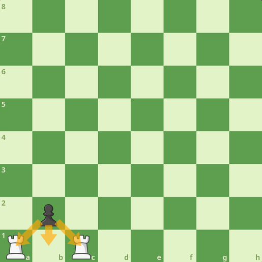
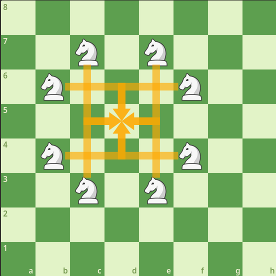

# PGN Compressor

<ins>P</ins>ortable <ins>G</ins>ame <ins>N</ins>otation (PGN) is a file format used to represent chess games.  
It contains every move, the result of the game, and may include extra information about, but not limited to, the place or the players.  

This project is an attempt of a lossless (*) compression of those files, alongside with decompression.  
It's rather made for fun than for being used and useful, as a chess game doesn't consist of much moves, then these files are very lightweight.  
Hence, it's just to see how far I can go with this idea.

(*) Extra spaces, tabulations and newlines will be erased though. Therefore the decompressed file will have less spaces than an original file with extra spaces.  

## Bits and bytes

PGN files are text files, thus any character (letter, space, digit...) takes 1 byte of storage.  
Although a byte may have a different amount of bits across architectures, it mostly happened in early computers (as far as I know, there were bytes of 7, 8 or even 9 bits).  
But to be simple and realistic (computers have changed since 70s), 1 byte is equal to 8 bits.  
It's important to keep this number in mind to compute the compression rate.  

# Introduction

Note: All PGN excerpts will use a programming language syntax highlighting (I chose R), as PGN hasn't its own.  

```r
[Event "F/S Return Match"]
[Site "Belgrade, Serbia JUG"]
[Date "1992.11.04"]
[Round "29"]
[White "Fischer, Robert J."]
[Black "Spassky, Boris V."]
[Result "1/2-1/2"]

1. e4 e5 2. Nf3 Nc6 3. Bb5 {This opening is called the Ruy Lopez.} 3... a6
4. Ba4 Nf6 5. O-O Be7 6. Re1 b5 7. Bb3 d6 8. c3 O-O 9. h3 Nb8 10. d4 Nbd7
11. c4 c6 12. cxb5 axb5 13. Nc3 Bb7 14. Bg5 b4 15. Nb1 h6 16. Bh4 c5 17. dxe5
Nxe4 18. Bxe7 Qxe7 19. exd6 Qf6 20. Nbd2 Nxd6 21. Nc4 Nxc4 22. Bxc4 Nb6
23. Ne5 Rae8 24. Bxf7+ Rxf7 25. Nxf7 Rxe1+ 26. Qxe1 Kxf7 27. Qe3 Qg5 28. Qxg5
hxg5 29. b3 Ke6 30. a3 Kd6 31. axb4 cxb4 32. Ra5 Nd5 33. f3 Bc8 34. Kf2 Bf5
35. Ra7 g6 36. Ra6+ Kc5 37. Ke1 Nf4 38. g3 Nxh3 39. Kd2 Kb5 40. Rd6 Kc5 41. Ra6
Nf2 42. g4 Bd3 43. Re6 1/2-1/2
```

Above is an example from [Wikipedia](https://en.wikipedia.org/wiki/Portable_Game_Notation), it'll help to understand the following explanations.  
It's mandatory to know this notation to understand the algorithm.  

The first 7 lines are <ins>tags</ins>, optional pairs of information.  
These 7 ones often are in PGN files, they're described as the <ins><em>Seven Tag Roster</em></ins>, and are often found in official tournament games.  

Below are each move. They use the [algebraic notation](https://en.wikipedia.org/wiki/Algebraic_notation_(chess)), introduced by its turn number.  
At the end, there is the result of the game, either a draw or a win/loss.  

# Vocabulary

A <ins>piece</ins> refers to anything <ins>but</ins> a pawn, and <ins>material</ins> means <ins>any piece or pawn</ins>. When talking about a pawn, the word pawn will simply be used.  

The chess board has 8 <ins>files</ins> and 8 <ins>ranks</ins>.  
<ins>Files</ins> are the columns, and they go from A to H.  
<ins>Ranks</ins> are the lines, and they go from 1 to 8.  
Thus A5 is the square both on the A file and the 5th rank.  

# Moves

## Turn numbers

As stated in the introduction, each turn is introduced by its number, i.e. `1. e4 e6`.  
However, according to this [PGN "specification"](http://www.saremba.de/chessgml/standards/pgn/pgn-complete.htm#c8.2.1) (quotes because I don't know if it's official and up-to-date or not), these turn numbers are optional.  
It means `e4 e6` seems to be a valid PGN, and both chess.com and lichess handle it correctly, so the compressor will not require them to be present.  
Still, both chess.com and lichess seem to ignore turn indications, because when submitting nonsense PGN (i.e. `2. e4 e6 7. a3 a6`, turns are obviously wrong), they do not complain and treat it as if turn numbers didn't exist (here, same as `e4 e6 a3 a7`).  
Because I think there are not much PGN with bad turn numbers, nor a good reason to have a bad number, and PGN files are often generated by chess websites, I personnaly find good to raise an error if such a bad number is found.  
In short, turn numbers are optional, but as long they are in the PGN, they must be valid. It's also not mandatory to specify all the turn numbers, it's valid as long they're correct (i.e. `e4 e6 2. a3 a7` is valid but `e4 e6 99. a3 a7` isn't because the 2nd move was marked as the 99th).  

Another point from this paper is about period(s). I personnaly have only seen turn numbers like `1.` (i.e. number then exactly one period), but it seem to be OK to have multiple periods, or even none.  
Both chess.com and lichess accept everything (no period, 1 period, or 2+ periods), so the compressor will behave the same.  

Here's an insight of what syntaxes will be valid <ins>in my compressor</ins> :
<table>
    <tr>
        <th>Move</th>
        <th>Comment</th>
    </tr>
    <tr>
        <td>1. e4 e6 2. a3 a7</td>
        <td>All turn numbers, 1 period each</td>
    </tr>
    <tr>
        <td>1... e4 e6 2 a3 a7</td>
        <td>All turn numbers, inconsistent number of periods</td>
    </tr>
    <tr>
        <td>e4 e6 2 a3 a7</td>
        <td>Some turn numbers, no period</td>
    </tr>
    <tr>
        <td>e4 e6 a3 a7</td>
        <td>No turn numbers</td>
    </tr>
</table>

## Move information

Typically, a move only describes which piece moves, and its destination square.  
For instance, `Nf6` means <em>Knight to F6</em>.  
But sometimes, things are not so easy, let's take an example of how complex a move can be :  

Let's take `Rbxb8#` :  
- `R` = a <ins>rook</ins> moves
- `b` = from file (column) <ins>B</ins>,
- `x` = then captures material when landing on
- `b8` = square <ins>B8</ins>,
- `#` = and finally delivers checkmate

## Ambiguous moves

As B8 square is located both on file B and the 8th rank, any rook on this file or this rank can move to B8, if there's no blocking piece.  
It means that sometimes, two rooks may be able to go on the same square at the same turn, and it's necessary to precise which one has been moved to disambiguate the situation.  
Thus the first 'b' in the algebraic notation of the above move.  

It's important to know how many same pieces are able to move to the same square on the same turn.  
For a rook, it's up to 4, up, down, left and right.  
Note that if there are multiple rooks in any direction, only one can move to the square, as it blocks others. This principle must be kept in mind.  
For a bishop, it's also up to 4, but for a knight and a queen, there are at most 8 squares.  

A move can also put the opponent's king in check, and it's included in the algebraic notation, with a trailing + (check) or # (checkmate).  
Here, we can get rid of it by letting the decompressor play the moves and see if there's a check.  

The remaining pieces of information are in the compression section.  

# Compression

As we saw in the above PGN example, there are a lot of useless characters, such as spaces and move numbers.  
The first step will be discarding them.  

## Delegating to the decompressor

As we'll see in the following explanation, the decompressor will have to play the moves as it decompresses them.  
It appears some pieces of information aren't strictly necessary and can be retrieved by looking at the board.  
For instance, when a move gives a check, it's not compressed.  
Instead, it's up to the decompressor to evaluate each move and then determine if a move puts the opponent's king in check.  
Another example is the `x` in the algebraic notation, to represent a capture. Here it won't be compressed and it's up to the decompressor to add it back.  
More examples will come, but keep this in mind.  

## Tags

Tags will be at the beginning of the output file, for instance

```r
[Event "F/S Return Match"]
[Round "29"]
```

will be `Event\00000000F/S Return Match\00000000Round\0000000029\00000000\00000000`.  
A trailing NUL byte is added, so that the decompressor can determine the end of tags. If no tag is provided, a '\0' is however put, to avoid misinterpreting the first move for a tag in the decompressor.  

## Moves

Let's go back to the moves.  
We established that something like `Rbxb8#` will be the most complex kind of move we can encounter.  
Also as said earlier, the '#' won't appear in the compressed file, as the decompressor will play the moves and determine if there's a check or not.  

There are 6 types of material, thus only 3 bits are sufficient to hold them. Thus, each material will be represented by 3 bits.  

<table>
    <tr>
        <td>King</td>
        <td>Queen</td>
        <td>Bishop</td>
        <td>Knight</td>
        <td>Rook</td>
        <td>Pawn</td>
        <td>Castling / Promotion (*)</td>
        <td>Comment / Alternative move(s) / NAG / End of the game (*)</td>
    </tr>
    <tr>
        <td>000</td>
        <td>001</td>
        <td>010</td>
        <td>011</td>
        <td>100</td>
        <td>101</td>
        <td>110</td>
        <td>111</td>
    </tr>
</table>

Then, the destination square contains a file and a rank.  
The chess board is 8*8-sized, which is very convenient, as a square can fit in 6 bits (6 bits = 2^6 = 64 values).  
As an example, the move `Rd2` is compressed as `\100\011\001`, thus 9 bits instead of 24 (`Rd2` is 3 characters, 8 bits each).  

As we said earlier, check(mate) marks (+ and #) aren't compressed, thus remains only how to deal with ambiguous moves.  

(*) These values are followed by 1 or 2 bits :  

<table>
    <tr>
        <td></td>
        <th>110</th>
        <th>111</th>
    <tr>
    </tr>
        <th>0</th>
        <td>Castling</td>
        <td>Comment / Alternative move(s)</td>
    </tr>
    <tr>
        <th>1</th>
        <td>Promotion</td>
        <td>NAG / End of the game</td>
    </tr>
</table>
<table>
    <tr>
        <td></td>
        <th>1110</th>
        <th>1111</th>
    </tr>
    <tr>
        <th>0</th>
        <td>Comment</td>
        <td>NAG</td>
    </tr>
    <tr>
        <th>1</th>
        <td>Alternative move(s)</td>
        <td>End of the game</td>
    </tr>
</table>

It means that castling is introduced by `\110\0`, and start of alternative moves by `\111\0\1`.  
The following bits will vary according to the action (i.e. castling and promotion begin with `\110`, but the rest is different).  

## Avoid using too many bits to lose some unused values

To be as efficient as possible, NAGs will use the same 4 bits as castling.  
If not, an extra bit would have been needed to represent a move (i.e. determine if it's a promotion, a queen move, or a NAG).  
It means `Qc7` (a queen move), which is currently introduced by 3 bits, would have needed an extra bit to represent the queen, because of NAGs.  
Indeed, there are 6 types of material (pawns and 5 kinds of pieces), 4 special "moves" (comments, alternative moves, castling, promotion). If we add NAGs, it is 11, and encoding it on 4 bits leaves 5 unused combinations, thus it's a significant loss. That's why I managed to use the 2 unused combinations (3 bits = 8 combinations - 6 material = 2 unused) for the special moves, and adding to them an extra bit isn't something to be worried about, as they're special they're less likely to happen than regular moves.  
As castling can happen at most twice, it means NAGs won't cost a lot of extra storage, as it adds a single bit to castling each time, thus losts at most 2 bits.  
There may be a better solution if we take in account the likelihood of every special move to occur, as castling is way more frequent than en passant.  
However, en passant is a pawn move and it's not a clever idea to add an extra bit for any pawn move, just to implement NAGs (which are rather unused).  
Moreover, one could argue that comments are alternative moves would be less common than castling, and then encoding NAGs with comments or alternative moves bits would be better, but on the other hand they may appear more than twice (reminder, castling happens up to twice), thus I think the optimal solution depends on file.  

## Special move : Castling

Castling is introduced by the 4 bits `\110\0` :  
- `\110` introduces either castling or promotion
- `\0` is only for castling

After that, another bit indicates whether we castle kingside or queenside :  

<table>
    <tr>
        <th>Kingside</th>
        <th>Queenside</th>
    </tr>
    <tr>
        <td>0</td>
        <td>1</td>
    </tr>
</table>

Examples :  

- `O-O` (kingside castling) is encoded as `\110\0\0`
- `O-O-O` (queenside castling) is encoded as `\110\0\1`

Note: There are many syntaxes to represent castling, they're detailed in [Multiple Castling Syntaxes](#multiple-castling-syntaxes) section.

## NAGs

NAGs are introduced by the 5 bits `\111\1\0` :  
- `\111` introduces either comment, alternative move, NAG or end of the game
- `\1` introduces either NAG or end of the game
- `\0` is only for NAG

[NAGs](https://en.wikipedia.org/wiki/Numeric_Annotation_Glyphs) describe the situation for the player (has the advantage, has a good opening, etc..).  
It uses a dollar sign followed by a number in 0-255, after a move, for instance `36. Re4 $23` means white's 36th move (rook to e4) puts black in zugzwang.  
They don't seem to be often used (see [here](https://chess.stackexchange.com/questions/27834/does-anything-actually-use-numeric-annotation-glyphs-nags)), and about half of their possible values are not defined (see Wikipedia link), thus each site implements them as they want.  
As there are 256 values, they always will be encoded in a single byte, thus `$23` will become `\110\0\1\00010111` :
- `\111\1\0` : 5 introduction bits (see at the beginning of this section)
- `\00010111` : 23 in binary

## Special move : Promotion

Promotion begins with 4 bits `\110\1` :  
- `\110` introduces either castling or promotion
- `\1` is only for promotion

After that come 2 bits to represent the piece in which the pawn promotes into :  

<table>
    <tr>
        <td>Queen</td>
        <td>Bishop</td>
        <td>Knight</td>
        <td>Rook</td>
    </tr>
    <tr>
        <td>00</td>
        <td>01</td>
        <td>10</td>
        <td>11</td>
    </tr>
</table>

Then, extra bit(s) may be added, according to how many pawns are able to promote at the same time :  
<table>
    <tr>
        <th>Number of pawns on the second-to-last rank (2nd or 7th)</th>
        <td>1</td>
        <td>&lt;= 2</td>
        <td>&lt;= 4</td>
        <td>&lt;= 8</td>
    </tr>
    <tr>
        <th>Number of bits</th>
        <td>0</td>
        <td>1</td>
        <td>2</td>
        <td>3</td>
    </tr>
</table>
If more than one pawn can promote, their files are compared and an index is stored.  
This index is a zero-based value which is 0 if the promoted pawn is the closest from A file, then increases as it moves away.  
As an example, let there are pawns on A7 and C7. If the first one (A7) is promoted, then its index is 0, otherwise it's 1 (as it's the second one).  
The rank (line) doesn't need to be encoded, as we know which player did the promotion, hence the decompressor will deduce it.  

As an example, `e8=Q` (there's only one pawn on the 7th rank) is encoded as `\110\1\01` :

- `\110\1` = promotion
- `\00` = queen
- no index, only one pawn

The same move `e8=Q` is then encoded `\110\1\00\1` if there's a pawn on B7, as this one can also promote.  

Ambiguous promotion :  
  
Here, the black pawn in B2 can be promoted in 3 different ways :
- captures rook on A1
- simply moves forward to B1
- captures rook on C1

The other case is when the promoted pawn is on the A or G file :  
  
Here the pawn still has two choices, push or capture, then two possible moves.  
Then, if the decompressor detects a situation like that (multiple destination squares to be promoted), 1-2 extra bit(s) will be added to store their zero-based file index (0 = smallest = closest to A, 1-2 = more to the right).  

As an instance, here's `axb1=Q` compressed :
- `\110\1\00\` : promotion to queen
- `\1` : 2 choices (A1 and B1), chose B1 (B > A)

On the other hand, `a1=Q` is encoded as :  
- `\110\1\00` : promotion to queen
- `\0` : A < B, first choice

Lastly, here's `bxc1=Q` from the penultimate example (with 3 ways to promote) :
- `\110\1\00` : promotion to queen
- `\10` : 3rd choice (landing on C file), as there's also A and B

## Special move : [(google) en passant](https://knowyourmeme.com/memes/en-passant-google-en-passant) <a id="en-passant"></a>

Firstly, remind that the algebraic notation of an en passant shows the square when the moved pawn <ins>lands</ins>, not the square where the enemy pawn got captured.  
As an instance, `axb3 e.p.` means a pawn in A4 captured an enemy pawn (just moved to B4) and then landed on `B3`.  

En passant is a special pawn capture, then a pawn move and is encoded as a pawn move, but it has 2 different notations :  
- `exd4` as a regular capture
- `exd4 e.p.` to explicitly refer to en passant

Either the first or the second notation can be used, and they both can be used across the whole file.  
To avoid losing this information, the compressed file will contain the notation used by each en passant.  
According to this [StackExchange thread](https://chess.stackexchange.com/questions/23220/what-is-the-maximum-number-of-en-passants-possible), there are up to 8 en passant in a game.  
The number of en passant will be stored at the very beginning of the compressed file, encoded using 4 bits, as 0 to 8 (both inclusive) en passant may happen, thus 9 possibilities.  
For each en passant, an extra bit is added after, to represent the used notation :  

<table>
    <tr>
        <th>Regular capture notation (exd4)</th>
        <th>En passant notation (exd4 e.p.)</th>
    </tr>
    <tr>
        <td>0</td>
        <td>1</td>
    </tr>
</table>

So en passant are encoded as other pawn captures, but their notations are stored at the beginning of the file.  
As an example, `\0010\0\1` means there are 2 en passant, where the first one uses a regular capture notation whereas the other one uses e.p. suffix.  

Note: It's important to keep this in mind, as alternative moves will reuse this process, it will be detailed there.  

## End of the game

If the game ends with a checkmate, then it's trivial to determine which player won the game.  
However players can resign early or agree on a draw, so in these cases, it must be encoded alongside the moves themselves.  
If the game ends with a checkmate, the winner isn't encoded as it's not needed.  

The end of the game is introduced by the bits `\111\1\1`.  
There are 2 more bits :  
<table>
    <tr>
        <th>00</th>
        <th>01</th>
        <th>10</th>
        <th>11</th>
    </tr>
    <tr>
        <td>White wins</td>
        <td>Black wins</td>
        <td>Draw</td>
        <td>Unused</td>
    </tr>
</table>

## Ambiguous moves

As explained earlier, there are at most 8 same pieces that can move to the same square in the same move.  
This is, once again, very convenient as it fits in 3 bits.  
But it can be optimized further, because bishops and rooks can only be 4 at a time to move to the same square, which fits in 2 bits.  
And in the case which the destination square is in an edge or corner, it may reduce this amount.  

<table>
    <tr>
        <td></td>
        <th>Queen</th>
        <th>Bishop</th>
        <th>Rook</th>
    </tr>
    <tr>
        <th>To a corner</th>
        <td>3</td>
        <td>1</td>
        <td>2</td>
    </tr>
    <tr>
        <th>To an edge (not in a corner)</th>
        <td>5</td>
        <td>2</td>
        <td>3</td>
    </tr>
    <tr>
        <th>To a center square (has 8 squares around it)</th>
        <td>8</td>
        <td>4</td>
        <td>4</td>
    </tr>
</table>

Actually, it's a bit more complicated for knights, as they cannot be right next to the destination square. Because they move in a 1x2 squares L, there's at least one square between the knight and the destination square.  

Here's a table for the knight :  
<table>
    <tr>
        <td></td>
        <th>Knight</th>
    </tr>
    <tr>
        <th>To a corner</th>
        <td>2</td>
    </tr>
    <tr>
        <th>To an edge, 1 square away from a corner</th>
        <td>3</td>
    </tr>
    <tr>
        <th>1 square away (diagonally) from a corner</th>
        <td>4</td>
    </tr>
    <tr>
        <th>1 square away from an edge, 2+ squares away from the other</th>
        <td>6</td>
    </tr>
    <tr>
        <th>Center (2+ squares away from any edge)</th>
        <td>8</td>
    </tr>
</table>

Thanks to them, we can optimize to the nearest bit, because the decompressor will be able to determine how many possibilities there are at most, and thus read the lowest amount of bits.  

Hence,

<table>
    <tr>
        <th>Maximum number of possibilities</th>
        <td>&lt;= 2</td>
        <td>&lt;= 4</td>
        <td>&lt;= 8</td>
    </tr>
    <tr>
        <th>Number of bits</th>
        <td>1</td>
        <td>2</td>
        <td>3</td>
    </tr>
</table>

For instance, when the moved piece is a queen and the destination square is in a corner, there are 3 possibilities, then it's encoded in 2 bits.  

To encode the starting square, we'll take the index of its coordinate.  
As an example, let's consider a rook move, to A1.  
A1 being a corner, there are indeed only at most two rooks, one in the 1st rank and the other in the A file. We'll take A4 and D1 as examples.  

Coordinates will be converted into a zero-based number (from 0 to 63):

- A4 = 1st rank and 4th file = 0 * 8 + 3 = 3
- D1 = 4th rank and 1st file = 3 * 8 + 0 = 24

Here A4 &lt; D1, thus A4 = 0 (lowest value) and D1 = 1 (highest value).  

The decompressor will handle this by looking at the board and determine how many pieces can move to the destination square (here, 2 rooks on A4 and D1), and how many there may be at most (2, as these are rooks going in a corner, see above tables).  
Then, it will take coordinates of each of these pieces (here, the 2 rooks) and convert them into their zero-based index.  
And last, it has to read from the compressed file the rank of the index, and then choose the right piece.  
The number of bits read is shown in the table just above.  

Here's how `Raa1` (rook on A4 is moved) will be translated (if there's another rook on D1), `\100\000\000\0` :

- `\100` = rook
- `\000` = A file
- `\000` = rank 1
- `\0` = lowest ranked rook is moved (here, in D4)

Important note : There cannot be ambiguous pawn moves.  
<table>
    <tr>
        <th>2 pawns can capture</th>
        <th>2 pawns can en passant</th>
        <th>2 pawns can capture + 2 pawns can en passant</th>
    </tr>
    <tr>
        <td></td>
        <td></td>
        <td></td>
    </tr>
    <tr>
        <td><ul>
            <li>dxe5</li>
            <li>fxe5</li>
        </ul></td>
        <td><ul>
            <li>dxe6 (e.p.)</li>
            <li>fxe6 (e.p.)</li>
        </ul></td>
        <td><ul>
            <li>dxe5</li>
            <li>fxe5</li>
            <li>dxe6 (e.p.)</li>
            <li>fxe6 (e.p.)</li>
        </ul></td>
    </tr>
</table>

We can easily notice that there cannot be any ambiguity, as :  
- for regular captures, one pawn per file is able to capture the target
- for en passant, same thing
- regular captures and en passant have different destination squares (regular = pawn, en passant = behind pawn)

## Comments

A comment may contain relevant information about the game or the move its next to, often the name of the opening if placed in the first moves.  
As stated above, comments are text inside curly brackets {}, like `{This opening is called the Ruy Lopez.}` for instance.  
They can be placed right next to a move (i.e. anywhere but between tags).  
Each comment is introduced by the 5 bits `\111\0\0` :
- `\111` is either for comment, alternative move, NAG or enf of the game
- `\0` is for comment or alternative move
- `\0` is only for comment
Then, the text is copied as it is in the PGN, and a NUL ASCII character `\00000000` is appended to end the comment.  

Examples :  

`{This opening is called the Ruy Lopez.}` is encoded as `\110\1\This opening is called the Ruy Lopez.\00000000` :  

- `\111\0\0` = comment
- `This opening is called the Ruy Lopez.` = text
- `\00000000` = NUL character to end text and comment

## Alternative moves

Alternative moves usually are often used to address a better move, or a variation in openings.  
Therefore they weren't played in the game, but are still relevant enough to appear in the PGN.  

This example is from the [Swedish Wikipedia about PGN](https://sv.wikipedia.org/wiki/Portable_Game_Notation) (there is no alternative moves example in the English page).  
Here, the parenthesis contains a better move than the one Black played.  
```r
1. e4 e5 2. Qh5 Nc6 3. Bc4 Nf6 (3... g6) 4. Qxf7# 1-0
```

Alternative moves are introduced by 5 bits `\111\0\1` :
- `\111` is for either comment, alternative moves, NAG or end of the game
- `\0` introduces either comment or alternative moves
- `\1` is for alternative moves only

In order to support nested alternative moves, there is an extra bit to read.  
These moves are parsed and stored with a stack :
- `\1` is to start a new alternative moves section
- `\0` is to end the last section

As an example, the above excerpt is encoded as :
- `\010\010\011` : Bc4
- `\011\101\101` : Nf6
- `\111\0\1\1` : `\111\0\1` for alternative moves, `\1` to begin
- `\101\110\101` : g6
- `\101\111\010` : h3
- `\111\0\1\0` : end of alternative moves

There's one thing left, there can be en passant in alternative moves, and then the writing method (e.p. suffix vs no suffix) must be stored.  
The exact same process will be used, meaning each alternative moves sequence will begin by a block representing en passant, as described in [en passant section](#en-passant).  

As an example, `(23... cxd6 e.p. axb3)` is encoded `\111\0\1\1\0010\10\101\011\101\101\001\011\111\0\1\0` (assuming there's only one pawn which can en passant at the same time, otherwise disambiguation would be needed) :  
- `\111\0\1\1` : starting sequence to introduce alternative moves
- `\0010` : 2 en passant
- `\10` : the first one uses e.p. notation, the second doesn't
- `\101\011\101` : a white pawn moves to d6 (reminder, capture (then en passant) is deduced from the decompresser replaying the game while parsing the file)
- `\101\001\011` : a black pawn moves to b3 (same as above, it's up to the decompressor to determine if there's a capture
- `111\0\1\0` : end of alternative moves

## Version

At the very beginning of the compressed file (even before en passant) are 8 bits representing a version number.  
This number starts at 0 and will be increased if the binary protocol will have breaking changes in the future.  
The version number allows the decompressor to identify which is the protocol version, and permits to correctly process compressed files using an older protocol.  

## Compression order


# Complete example

Here is an example of a PGN which uses every aforementioned notation :  
```r
[Date "Epoch: 01/01/1970"]
1. e4 e6 2. e5 d5 e.p. (2... d6 {Avoids en passant}) 3. exd6 Qxd6 4. Qf3 Be7
5. d3 Nf6 6. Bg5 {Blunder, Qe5+ wins the bishop.} O-O 7. Nc3 Nd5 8. Bxe7 Nxe7
9. O-O-O a5 10. a3 a4 11. b4 axb3 {En passant !!} 12. Kd2 b2
13. Ra1 bxa1=Q $41 {Black has the attack} 14. a4 Qxc3+ 15. Kxc3 Nd5+ 16. Kc4 Qb4# 0-1
```

This game is encoded as :
| Bits | Sum | Compressed | Description |
| ---- | --- | ---------- | ----------- |
| 6 | 6 | `\0010\10` | 2 en passant, the first one has e.p but the second one hasn't |
| 5\*8 + 18\*8 = 184 | 190 | `Date\00000000Epoch: 01/01/1970\00000000` | `Date` tag |
| 8 | 198 | `\00000000`    | NUL byte to end tags |
| 9 | 207 | `\101\100\011` | e4 |
| 9 | 216 | `\101\100\101` | e6 |
| 9 | 225 | `\101\100\100` | e5 |
| 9 | 234 | `\101\011\100` | d5 |
| 8 | 242 | `\111\1\1\000` | starts new alternative moves sequence (no en passant, hence the last 3 bits are 0) |
| 9 | 251 | `\101\011\101` | d6 |
| 4 + 18*8 = 148 | 399 | `\110\1\Avoids en passant\00000000` : {Avoids en passant} comment
| 5 | 404 | `\111\1\0` | ends the alternative moves sequence |
| 9 | 413 |`\101\011\101` | exd6 |
| 9 | 422 |`\001\011\101` | Qxd6 |
| 9 | 431 |`\001\101\010` | Qf3 |
| 9 | 440 |`\010\100\110` | Be7 |
| 9 | 449 |`\101\011\010` | d3 |
| 9 | 458 |`\011\101\101` | Nf6 |
| 9 | 467 |`\010\110\100` | Bg5 |
| 4 + 31*8 = 252 | 719 | `\110\1Blunder, Qe5+ wins the bishop.\00000000` | {Blunder, Qe5+ wins the bishop.} comment |
| 6 | 725 | `\110\0\0\0` | O-O |
| 9 | 734 | `\011\010\010` | Nc3 |
| 9 | 743 | `\011\011\100` | Nd5 |
| 9 | 752 | `\010\100\110` | Bxe7 |
| 9 | 761 | `\011\100\110` | Nxe7 |
| 6 | 767 | `\110\0\0\1` | O-O-O |
| 9 | 776 | `\101\000\100` | a5 |
| 9 | 785 | `\101\000\010` | a3 |
| 9 | 794 | `\101\000\011` | a4 |
| 9 | 803 | `\101\001\011` | b4 |
| 9 | 812 | `\101\001\010` | axb3 |
| 4 + 14*8 = 116 | 928 | `\110\1En passant !!\00000000` | {En passant !!} comment |
| 9 | 937 | `\000\011\001` | Kd2 |
| 9 | 946 | `\101\001\001` | b2 |
| 9 | 955 | `\100\000\000` | Ra1 |
| 7 | 962 | `\111\0\00\0` | promotes to a queen in the first square (here, A1) |
| 13 | 975 | `\110\0\1\00101001` | NAG 41 |
| 4 + 21*8 = 172 | 1147 | `\110\1Black has the attack\00000000` | {Black has the attack} comment |
| 9 | 1156 | `\101\000\011` | a4 |
| 9 | 1165 | `\001\010\010` | Qxc3+ |
| 9 | 1174 | `\000\010\010` | Kxc3 |
| 9 | 1183 | `\011\011\100` | Nd5 |
| 9 | 1192 | `\000\010\011` | Kc4 |
| 9 | 1201 | `\001\001\011` | Qb4# |

## Compression ratio :

The above PGN has 328 bytes / characters (if all the moves are on a single line), thus 328 * 8 = 2624 bits (328 bytes).  
Then the above table shows the file can be compressed in 1188 bits (148.5 bytes).  
2624 / 1201 ~= 2.185
1201 / 2624 ~= 0.4577
Thus this file is 2.185 times smaller when compressed (compressed size is about 45.77% of the uncompressed size).  
Take note this ratio might change according to the file content, for instance if there are a bunch of checks, the ratio will increase (i.e. in `Qd2+`, the check is deduced and the `+` isn't encoded).  

# Discontinued ideas

Before I figured out comments/alternative moves/NAGs can be encoded at the same place they're in the PGN, I thought about encoding them at the end of the file, right after the moves.  

In order to save the idea and especially the work, I'll put it below, even if it won't be used, it although contains some interesting pieces of information.  

--

Comments are after the last move, starting with 3 bits `\110`, as shown in table in above "moves" section.  
Each comment applies to a certain move played by a certain player, so these two information must be contained in the output file.  
As there are 2 players, it can fit in a single bit :  

<table>
    <tr>
        <th>Black</td>
        <th>White</td>
    </tr>
    <tr>
        <td>0</td>
        <td>1</td>
    </tr>
</table>

However, it's not very clear about how many moves a chess game can theoratically last.  
According to this [chess.com forum thread](https://www.chess.com/forum/view/general/maximum-number-of-moves-1), games rarely exceed 100 moves, but that's far from the maximum possible.  
It seems that there's no accurate estimation, but here's what I managed to find :  

- ~ 6 000 moves in another [chess.com forum thread](https://www.chess.com/forum/view/general/whats-the-greatest-number-of-moves-that-could-ever-be-achieved-in-a-chess-game?page=2)
- ~ 6 000 moves again in a [YouTube video](https://www.youtube.com/watch?v=D5DXJxR3Uig)
- ~ 9 000 moves according to a [mathematician](https://wismuth.com/chess/longest-game.html)

To set up a margin of error, the biggest value (9 000) must be represented.  
Take note that moves are 1-based (starting at 1), but when encoded it will be 0-based (starting from 0).  
Examples :  
Here the trailing NUL character is added to keep these examples straightforward, but don't forget that it appears only if there's a comment or an alternative move after.  

In `3. Nf3 {Some comment} e6`, the comment is encoded as `\0\000011\1Some comment\00000000` :  

- `\0` = form bit, 0 = short form
- `\000010` = 2 in binary (6 bits), as it starts from 0
- `\1` = player bit, 1 = White
- `Some comment` = text
- `\00000000` = NUL character to end text and comment

In `134. Ke5 Rd8 {Blunder !}`, the comment is encoded as `\1\00000010000101\0Blunder !\00000000` :  

- `\1` = form bit, 1 = extended form
- `\00000010000101` = 133 in binary (14 bits), as it starts from 0
- `Blunder !` = text
- `\00000000` = NUL character to end text and comment


# Notes
## Multiple castling syntaxes <a id="multiple-castling-syntaxes">

According to [this chess stackexchange thread answer](https://chess.stackexchange.com/a/16895), castling notation in PGN files may be represented in many ways:

1- O-O / O-O-O (uppercase o)  
2- 0-0 / 0-0-0 (zero digit)  
3- Kc1 / Kg1 / Kc8 / Kg8 (king destination square)  

Only options 1- and 2- are handled by the compressor, as in my experience they're way more common than the latter. Perhaps option 3- will be supported in a future version, but I don't provide such guarantee.
